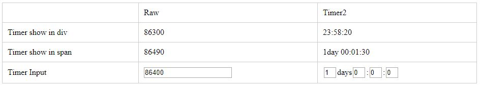

Timer2
=======

Timer2 is a jQuery-based time period setter and formater.
It convert seconds to days:hours:minutes:seconds

Browser compatibility
---------------------
* Chrome 8+
* Firefox 10+

Usage
-----
See examples

Copyright and license
---------------------
The license is available within the repository in the [LICENSE][license] file.
